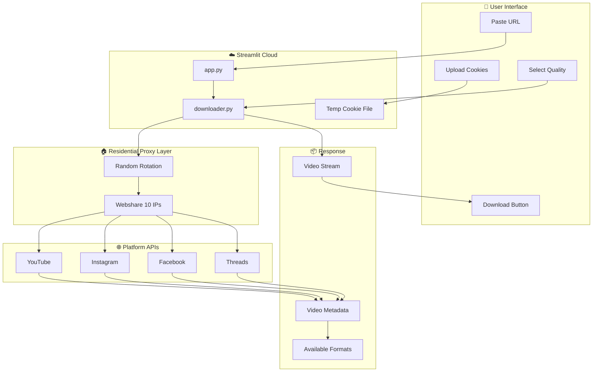
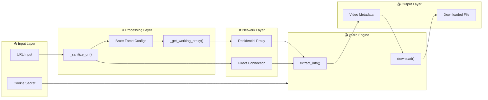
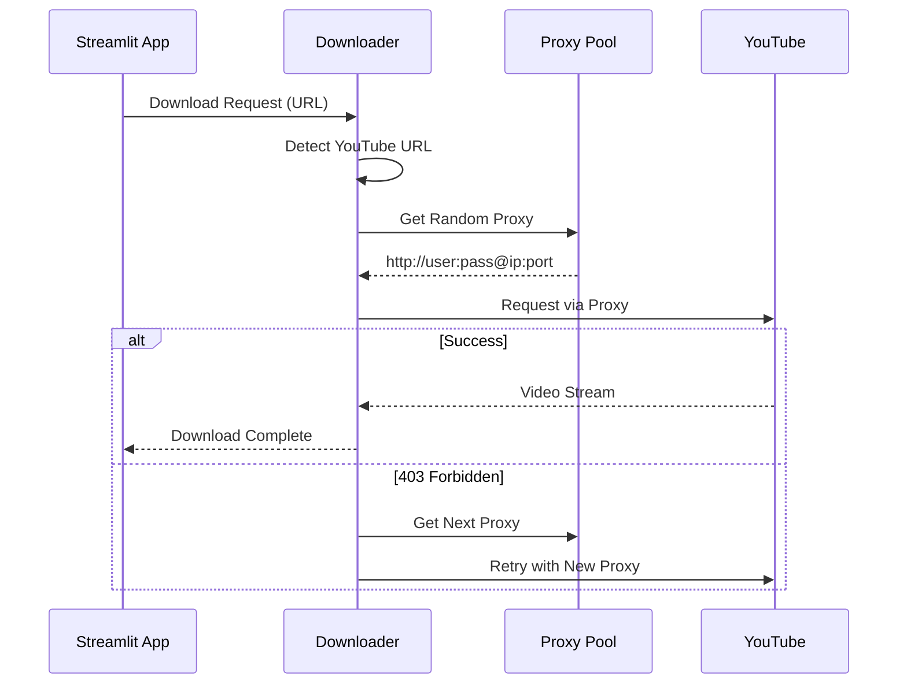

# 🏗️ System Architecture - Universal Media Downloader

## High-Level Data Flow

---

## Detailed Component Diagram

---

## Proxy Rotation Strategy

---

## Client Simulation Order

| Priority | Client | Use Case |
|----------|--------|----------|
| 1 | `android_creator` | Bypasses most cloud blocks |
| 2 | `ios_creator` | Alternative creator client |
| 3 | `tv_embedded` | TV app simulation |
| 4 | `android` | Standard mobile |
| 5 | `ios` | Apple devices |
| 6 | `mweb` | Mobile web |
| 7 | `web` | Desktop fallback |

---

## Key Files

| File | Purpose |
|------|---------|
| `app.py` | Streamlit UI, session state, download triggers |
| `downloader.py` | Core yt-dlp wrapper, proxy rotation, format processing |
| `cookies.txt` | Local cookie storage |
| `COPY_THIS_TO_STREAMLIT.toml` | Streamlit Secrets template |
