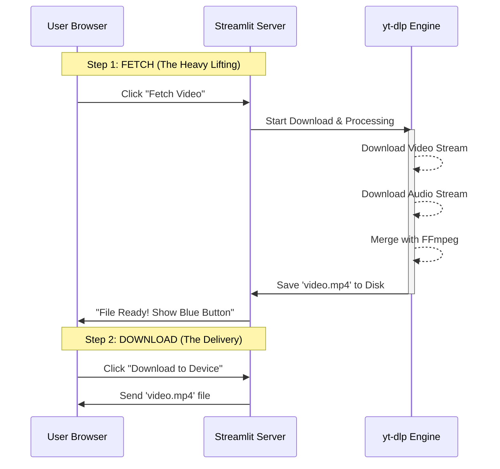
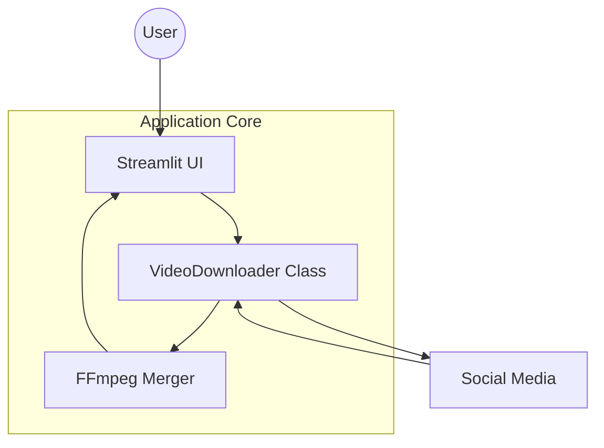

# ⬇️ Universal Media Downloader

A powerful, cross-platform media downloader built with **Python**, **Streamlit**, and **yt-dlp**. 
Supports downloading videos, audio, and extraction from YouTube, Instagram, Facebook, X (Twitter), TikTok, Pinterest, and 1,000+ other sites.

## 🚀 Features

*   **Universal Support**: Works on almost any site supported by `yt-dlp`.
*   **Smart Quality Selection**: 
    *   See resolutions (1080p, 720p, etc.) before downloading.
    *   **Auto-Merge**: Automatically combines high-quality video and audio streams (using FFmpeg).
    *   **Audio Only**: Extract to MP3 directly.
*   **Dual Interface**:
    *   **Web App**: Modern UI using Streamlit (`app.py`).
    *   **Desktop App**: Classic UI using Tkinter (`main.py`).
*   **Cloud Ready**: Pre-configured for deployment on Streamlit Cloud.
*   **Self-Healing**: Includes GitHub Actions to auto-update dependencies weekly.

---

## 🛠️ Installation & Local Usage

### Prerequisites
*   Python 3.10+
*   Git

### 1. Clone the Repository
```bash
git clone https://github.com/pravindev666/Alpha-Universal-Video-Downloader.git
cd Alpha-Universal-Video-Downloader
```

### 2. Install Dependencies
```bash
pip install -r requirements.txt
```

### 3. Install FFmpeg (Critical for 1080p+)
If you are on Windows, run this helper script to download and install FFmpeg automatically:
```bash
python setup_ffmpeg.py
```
*On Linux/Mac, install via your package manager (e.g., `sudo apt install ffmpeg`).*

### 4. Run the App
**Web Interface (Recommended):**
```bash
streamlit run app.py
```

**Desktop Interface:**
```bash
python main.py
```

---

## ☁️ Deployment (Streamlit Cloud)

This project is ready for 1-click deployment.

1.  **Push to GitHub**: Make sure `packages.txt` is in your repo (it installs FFmpeg on the cloud).
2.  **Deploy**: Connect your repo to Streamlit Cloud.
3.  **Done**: No other configuration needed.

### 🔄 Auto-Maintenance
Social media sites change their code frequently. To keep the downloader working:
*   **Locally**: Run `pip install -U yt-dlp` regularly.
*   **On Cloud**: The included GitHub Action (`.github/workflows/update_ytdlp.yml`) will automatically check for updates **every Sunday**, update `requirements.txt`, and redeploy your app.

---

## 🖼️ Social Sharing Card (WhatsApp/Facebook)
Streamlit Cloud handles the social preview card (the image you see when sharing the link). You cannot change this from the code.

1.  Go to your app on **share.streamlit.io**.
2.  Click the **Matches (⋮)** menu -> **Settings**.
3.  Under **General**, you will see **"Social preview"**.
4.  Upload the `social_preview.png` file included in this repo.


---

## 🏗️ Architecture

### How strictly "Fetch" vs "Download" works
Browsers timeout if a server takes too long to respond. Since downloading a video takes time, we split the process into two steps:



### System Components


---

## 🛠️ Challenges & Solutions (The Dev Journey)

Building a robust universal downloader is a constant battle against bot-detection and platform changes. Here is what we solved:

### 1. The "403 Forbidden" Wall
**Problem:** YouTube and other sites block cloud server IPs (like Streamlit Cloud) with a 403 error.
**Solution:**
- **Spoofing**: Forced the `Android` client and browser-like headers.
- **IPv4 Logic**: Forced usage of `0.0.0.0` to avoid IPv6 blocks.
- **Proxy Rotation**: Implemented a fallback system that tries different free proxies if the direct connection fails.

### 2. Login & Private Content (Cookies)
**Problem:** Downloading private Instagram posts, age-restricted YouTube videos, or Threads content requires authentication.
**Solution:**
- **Cookie Secrets**: Integrated Streamlit `st.secrets` to securely store `cookies.txt` on the cloud.
- **Manual Upload**: Added a file uploader so users can provide their own temporary cookies for private downloads.
- **Consolidated Handling**: Created a system to combine cookies from YouTube, Instagram, and Threads into one single "Master Cookie" file.

### 3. Threads.net "Unsupported URL"
**Problem:** Threads used multiple domains (`.com` and `.net`) and complex URL structures that confused the standard extractor.
**Solution:**
- **URL Normalization**: Built a custom sanitizer that converts `@user/post/ID` to the simpler `t/ID` format.
- **Domain Hotfix**: Automatically swaps `threads.com` for `threads.net` to match downloader requirements.

### 4. Playback Flickering (VLC)
**Problem:** Some high-res videos flickered or stuttered for a few seconds when first opened in VLC.
**Solution:** 
- **Fast-Start**: Implemented the `-movflags +faststart` flag in FFmpeg. This moves the video metadata to the beginning of the file so the player can start smoothly without delay.

### 5. Stale Data (Old Video Bug)
**Problem:** Pasting a new URL sometimes still showed the thumbnail or download link for the *previous* video.
**Solution:**
- **Reactive UI**: Removed the input form to ensure the app reacts the moment research begins.
- **Memory Wipe**: Added logic to explicitly delete old session memory and files whenever a new URL is detected.

---
